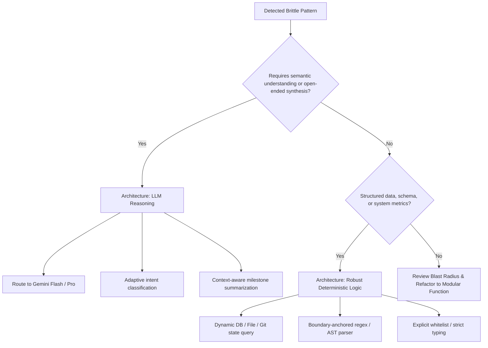

# 🔬 Hardcode & Regex Auditor

The **Hardcode & Regex Auditor** systematically scans Python tools, background sidecars, and Discord handlers to root out brittle heuristics, static mock data, hardcoded identity checks, and fragile regex patterns. It determines whether each finding requires **LLM semantic reasoning** or **robust deterministic logic** and guides test-driven remediation.

---

## 🎯 When to Activate This Skill
* **Monthly Codebase Hardening Sweeps:** Periodic architectural health reviews to prevent code rot and heuristic degradation.
* **Pre-Refactor / Pre-Commit Audits:** Before modifying routing filters, message classifiers, or text sanitization pipelines.
* **Forensic Debugging of Missed Directives or Collisions:** When short user commands (e.g. `"run tests"`, `"ship it"`) get dropped, or when regexes misidentify messages (e.g. 429 rate limits triggering Plex indexers).
* **Eliminating Mock & Frozen State:** Replacing static agenda templates, hardcoded user lists, or arbitrary word-count gates with live state and dynamic models.

---

## 🏛️ The 4 Fragility Archetypes

| Archetype | Manifestation | Impact / Failure Mode | Recommended Architecture |
| :--- | :--- | :--- | :--- |
| **1. Heuristic Filter Gates** | Arbitrary word counts (`len(split()) < 4`), punctuation gating. | Drops valid terse engineering commands (`"ship it"`, `"run tests"`). | **LLM Intent Routing:** Bypass prefilters for action verbs or pass directly to model scoring. |
| **2. Fragile & Unanchored Regexes** | `\d+\.\d+` without token/score boundaries, naive tag strippers `<[^>]+>`. | Matches token counts or memory IDs as confidence scores; destroys generics (`Vector<T>`) and math inequalities. | **Robust Deterministic Logic:** Boundary-anchored regexes (`r'(?:Score\|Relevance):\s*([0-1](?:\.\d+)?)'`), explicit tag whitelists, or HTML parsers. |
| **3. Frozen Templates & Agendas** | Hardcoded agenda items (`"Amos — Ledger DDL"`), mock milestone strings. | Stale carry-forward summaries; false progress reporting. | **Dynamic State & LLM Synthesis:** Query live Git commits/PRs and pass to model for adaptive standup generation. |
| **4. Hardcoded Identities in Logic** | `if speaker == "Ryan"`, hardcoded couple combining lists. | Fragile branching; fails when new collaborators or contacts join. | **Dynamic Store Queries:** Query profile metadata (`/workspace/memory/`) and graph relationships dynamically. |

---

## ⚖️ Architectural Decision Matrix: LLM Reasoning vs. Deterministic Logic

When auditing a finding, apply this decision framework:



### Rule of Thumb:
* **Use LLM Reasoning when:** Evaluating ambiguous natural language, classifying open-ended intent, summarizing conversational dialogue, or synthesizing dynamic agendas.
* **Use Deterministic Logic when:** Handling timestamps, mathematical inequalities, structured configs, database queries, or protocol envelopes. Avoid replacing fast regexes with expensive LLM calls if an anchored regex or AST parser is 100% deterministic.

---

## 🛠️ Automated Verification & Tooling

The companion auditor script is located at [`/workspace/tools/hardcode_regex_auditor.py`](file:///workspace/tools/hardcode_regex_auditor.py) (and symlinked in `scripts/audit.py`):

```bash
# 1. Full codebase scan across /workspace/tools
python3 /workspace/tools/hardcode_regex_auditor.py

# 2. Filter for HIGH severity issues only
python3 /workspace/tools/hardcode_regex_auditor.py --severity HIGH

# 3. Machine-readable JSON output for automated pipelines
python3 /workspace/tools/hardcode_regex_auditor.py --json

# 4. Quiet run (suppresses output if clean)
python3 /workspace/tools/hardcode_regex_auditor.py --quiet
```

---

## 📋 Remediation Protocol

When remediating findings:
1. **Never break existing callers:** Maintain function signatures and return types.
2. **Implement dynamic fallback:** If an LLM call fails or times out, degrade gracefully to dynamic state, never frozen mock strings.
3. **Mandatory Regression Tests:** Add explicit test cases to [`/workspace/tools/test_hardcoded_rule_fixes.py`](file:///workspace/tools/test_hardcoded_rule_fixes.py) and [`/workspace/tools/test_regex_fixes.py`](file:///workspace/tools/test_regex_fixes.py).
4. **Run Suite Before Claiming Pass:** Execute regression suites and confirm zero failures.
